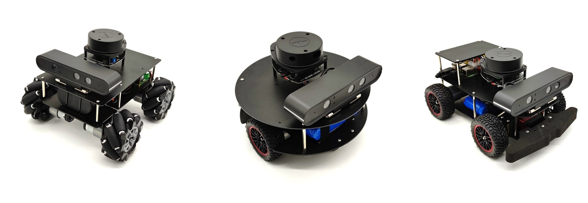

# 塔克R10系列机器人-ROS开发指南

## 塔克创新介绍
  塔克创新R10系列机器人，包含
  
  阿凡 阿斯顿非 df
   as啊

## R10系列机器人介绍
  塔克创新R10系列机器人，包含麦克纳木
  
  阿凡 阿斯顿非 df
   as啊

## 运行条件
> bashrc配置说明，   
* 条件一
* 条件二
* 条件三
出场时

> 列出运行该项目所必须的条件和相关依赖  
* 条件一
* 条件二
* 条件三

快捷指令

VNC

NFS

## 功能包说明
> 说明如何运行和使用你的项目，建议给出具体的步骤说明
* xtark_robot | 机器人底盘驱动功能包
  asdf
* xtark_description | 机器人URDF模型描述文件功能包
* 操作三  
* 操作三  

## 操作说明
> 如果有测试相关内容需要说明，请填写在这里  

launch文件介绍

## 塔克创新媒体
> 如果有测试相关内容需要说明，请填写在这里  